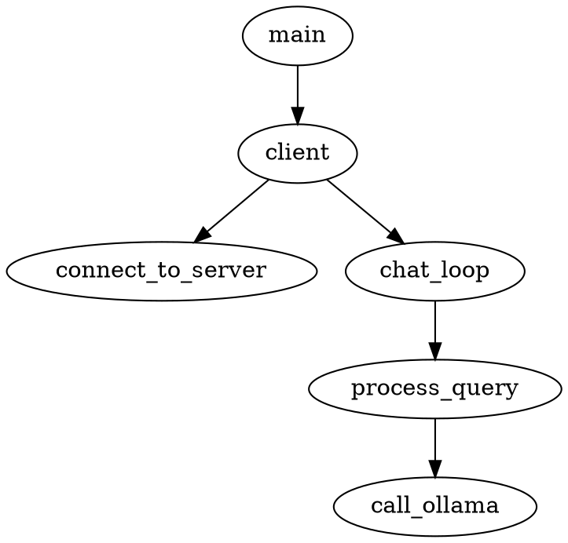

## 执行流分析

总体的执行流.

```
             +--------+
             | ollama |
             +--------+
               ^    |
               |    |
            [3]|    |[4]
               |    |
               |    v
             +--------+       [1]         +--------+
    [2]      |        |  <--------------  |        |
 -------->   | Client |                   | server |
             |        |  -------------->  |        |
             +--------+       [5]         +--------+

```

| 执行流 | 说明                                         |
|--------|----------------------------------------------|
| 1      | 获取工具列表                                 |
| 2      | 获取用户输入                                 |
| 3      | 将工具列表、用户输入传输给ollama解析         |
| 4      | ollama分析用户输入和工具，返回需要调用的工具 |
| 5      | 调用工具并获取输出                           |


如上所示，总共存在 5 次数据交互，其中client、server 之间通过 json 交互，
其他地方通过字符串交互.

[4] 返回的为json 格式的字符串，解析后用于调用server 的工具.


## mcp_server源码分析

mcp_server 中，我们(作为mcp终端用户)做了什么?

- 定义工具: 工具名称、参数、定义函数文档字符串
- 工具具体实现

mcp_server 中，mcp 库为我们实现了什么?

- 确保进程执行后mcp_server 运行在后台
- 根据代码解析获得tool json
- 处理mcp_client 传输过来的工具列表请求，并回复tool json给mcp_client
- 相应工具执行请求并返回结果

## mcp_client源码分析

一般来说，做为终端用户不会自己实现mcp_client，mcp_client 通常会集成到常用的IDE工
具中，不需要自己实现.
这里我们分析，mcp_client代码中和mcp 库分别做了哪些事情.

mcp_client 中实现了哪些功能:

- 连接mcp_server，获取工具列表
- 获取用户输入
- 递交信息给LLM处理
- 调用mcp_server 工具
- 输出返回信息

mcp 库为我们实现了哪些功能:

- 连接mcp server
- 通过json 与mcp server 交互
- 与LLM 交互接口[不确认]

### 流程图



## 附录

### mcp server tool信息

这是在`mcp client` 中得到的来自 server 的工具信息，这些信息会与用户的输入一起递
交给LLM 处理.

```
# 工具名称 - 函数名
tools.name get_alerts
# 工具描述 - 函数注释
tools.description

Get weather alerts for a US state.

    Args:
        state: Two-letter US state code (e.g. CA, NY)

# 函数参数
tools.inputSchema
{
    'properties': {'state': {'title': 'State', 'type': 'string'}},
    'required': ['state'],
    'title': 'get_alertsArguments',
    'type': 'object'
}


# 工具名称 - 函数名
tools.name get_forecast
# 工具描述 - 函数注释
tools.description

Get weather forecast for a location.

    Args:
        latitude: Latitude of the location
        longitude: Longitude of the location

# 函数参数
tools.inputSchema
{
    'properties': {'latitude': {'title': 'Latitude', 'type': 'number'}, 'longitude': {'title': 'Longitude', 'type': 'number'}},
    'required': ['latitude', 'longitude'],
    'title': 'get_forecastArguments',
    'type': 'object'
}

```

