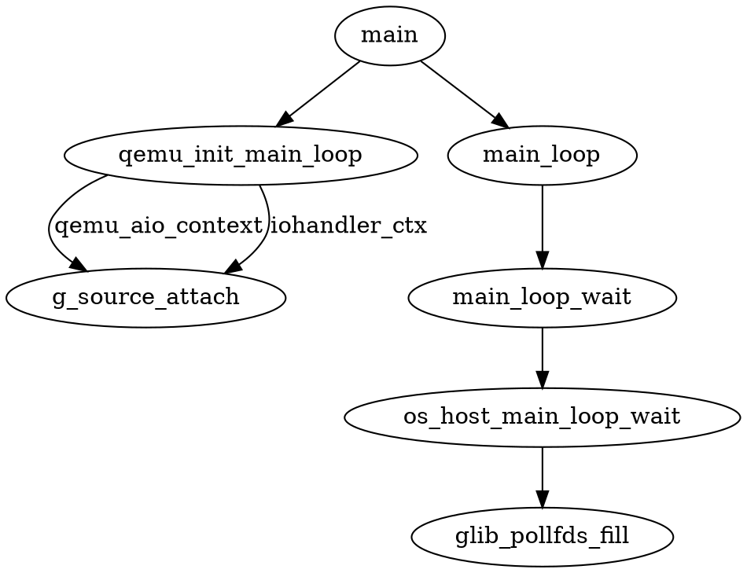

```dot
digraph G {
    main -> qemu_init_main_loop;
    qemu_init_main_loop -> g_source_attach[label="qemu_aio_context"];
    qemu_init_main_loop -> g_source_attach[label="iohandler_ctx"];

    main -> main_loop;
    main_loop -> main_loop_wait;
    main_loop_wait -> os_host_main_loop_wait;
    os_host_main_loop_wait -> glib_pollfds_fill;
}
```

