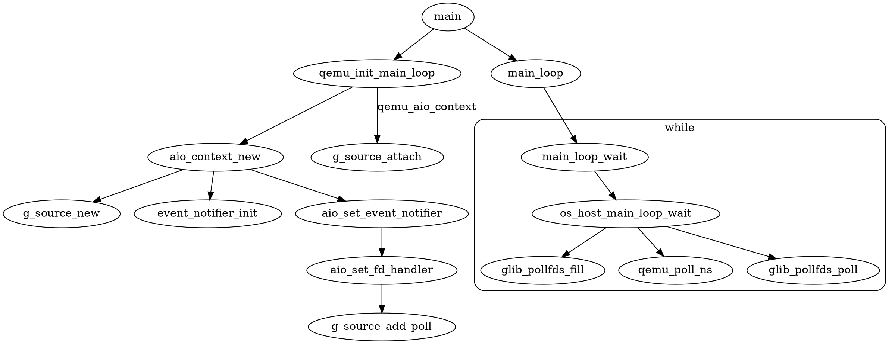
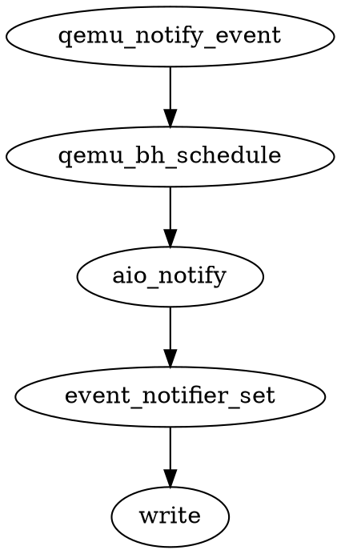
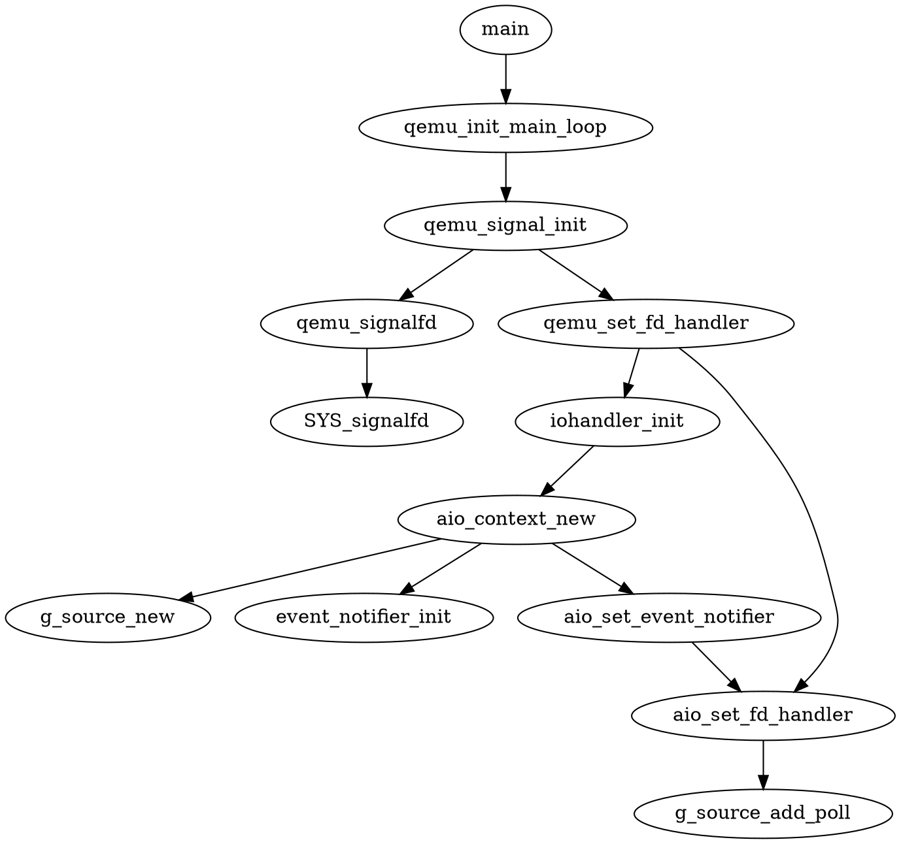

## 事件循环机制

以`qemu_aio_context` 为例.

### 函数调用关系



事件循环机制也就是通过`ppoll()` 监听事件，这里分几个部分：

* 初始化部分，申请`GSource` 并设置`fd`
* `GSource` 绑定到`GMainContext`
* 循环监听

上述三部分分别对应上图中的三个分支，综合来说就是，对应着`GSource`的初始化、绑定和
使用.

### 事件触发

事件出发需要`fd`，函数的`fd` 在`event_notifier_init()`中初始化;

`fd` 分两部分，写 和 读，分别对应**通知事件到来** **监听事件**，被监听的`fd`
通过`g_source_add_poll()` 添加到上下文链表中，后续会在`main_loop` 中监听该`fd`.

事件触发流程为：




### 附录


#### iohanlder_ctx初始化



触发是通过`SYS_signalfd()` 创建的fd触发的，接收到信号之后会自动触发该`fd`.


#### TODO

* `qemu_aio_context` `iohandler_ctx` 这两个是如何区分的？
    ```
    初始化实际是一样的，这两个不同是因为向这两个`Gsource`发送通知的事件源不同.
    ```
* `iohandler_ctx` 是什么时候触发的.
    ```
    可以发送信号给QEMU进程时触发:
    kill -S SIGALRM <PID>
    ```
* `GSource` 是一对多的么？
    ```
    是一对多的
    ```
* `AioContext{}` 中的定时器机制
* 

