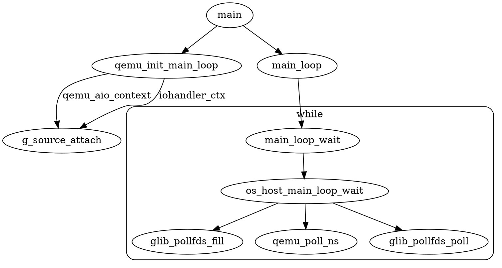

```dot
digraph G {
    main -> qemu_init_main_loop;
    qemu_init_main_loop -> g_source_attach[label="qemu_aio_context"];
    qemu_init_main_loop -> g_source_attach[label="iohandler_ctx"];

    main -> main_loop;
    main_loop -> main_loop_wait;
    subgraph cluster_while {
        label = "while"
        style = "rounded"

        main_loop_wait -> os_host_main_loop_wait;
        os_host_main_loop_wait -> glib_pollfds_fill;
        os_host_main_loop_wait -> qemu_poll_ns;
        os_host_main_loop_wait -> glib_pollfds_poll;
    }
}
```

